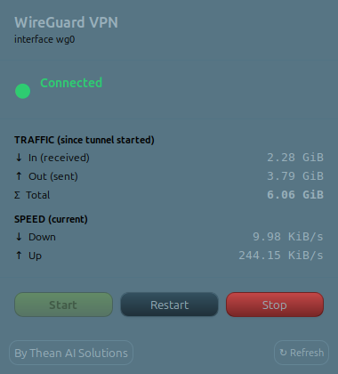

# wg-gtk-client

A minimal **GTK3 desktop client for WireGuard**. Start, restart and stop a
tunnel from a small window, with a live connection indicator, cumulative
traffic counters and current transfer speed.

No daemon, no background service, no stored credentials — just a single Python
script that talks to `wg-quick` through `pkexec`.



## Features

- **One-click control** — Start / Restart / Stop a WireGuard interface.
- **Live status** — connected / disconnected indicator, auto-refreshed every 5 s.
- **Traffic meter** — bytes received, sent and total since the tunnel came up.
- **Speed** — current down/up rate.
- **Public IP check** *(optional)* — confirms your traffic is leaving through
  the VPN, with a `✓ via VPN` badge when it matches an expected address.
- **No persistent privileges** — privileged actions use `pkexec` (a graphical
  password prompt); status, traffic and speed are read from the kernel and
  need no root at all.

## Requirements

- Linux with a running WireGuard tunnel configured via `wg-quick`
  (e.g. `/etc/wireguard/wg0.conf`)
- `wireguard-tools` (provides `wg-quick`)
- Python 3 with PyGObject and GTK 3
- `polkit` (provides `pkexec`)
- `curl` (only for the optional public-IP check)

On Debian/Ubuntu/Linux Mint:

```bash
sudo apt install python3-gi gir1.2-gtk-3.0 wireguard-tools policykit-1 curl
```

## Install

```bash
git clone https://github.com/TheJonaz/wg-gtk-client.git
cd wg-gtk-client
./install.sh
```

This copies `wg-gtk-client` into `~/.local/bin` and a launcher into your
application menu. No root required. Uninstall with `./install.sh --uninstall`.

You can also just run it directly without installing:

```bash
./wg-gtk-client.py
```

## Usage

```
wg-gtk-client [-i INTERFACE] [--vpn-ip IP] [--no-public-ip]

  -i, --interface   WireGuard interface name (default: wg0)
  --vpn-ip          Expected public IP when connected; shows a "via VPN"
                    confirmation when the detected public IP matches.
  --no-public-ip    Do not query an external service for the public IP.
```

Examples:

```bash
wg-gtk-client                          # control wg0
wg-gtk-client -i wg1                   # control a different interface
wg-gtk-client --vpn-ip 203.0.113.10    # show "✓ via VPN" when matched
wg-gtk-client --no-public-ip           # fully offline, no external lookups
```

To pass options from the application menu, edit the `Exec=` line in
`~/.local/share/applications/wg-gtk-client.desktop`.

## How it works

| Concern        | Mechanism                                                        |
|----------------|------------------------------------------------------------------|
| Up / down      | `pkexec wg-quick {up,down} <iface>` — graphical auth per action  |
| Connection     | `ip link show <iface>` — no privileges                           |
| Traffic        | `/sys/class/net/<iface>/statistics/{rx,tx}_bytes` — no privileges|
| Speed          | byte deltas between polls (every 5 s)                            |
| Public IP      | `curl https://ifconfig.me` (optional, disable with `--no-public-ip`) |

The kernel byte counters reset whenever the interface is recreated, so the
traffic figures reflect the **current session** (since the tunnel was last
started). The speed calculation guards against these resets so you never see
spurious spikes.

## Notes

- Built and tested on Linux Mint (Cinnamon, X11) with GTK 3.
- It controls tunnels managed by `wg-quick`; it does not create or edit
  WireGuard configuration files.

## License

[MIT](LICENSE) © 2026 Jonaz Thern

---

By [Thean AI Solutions](https://www.thern.io)
